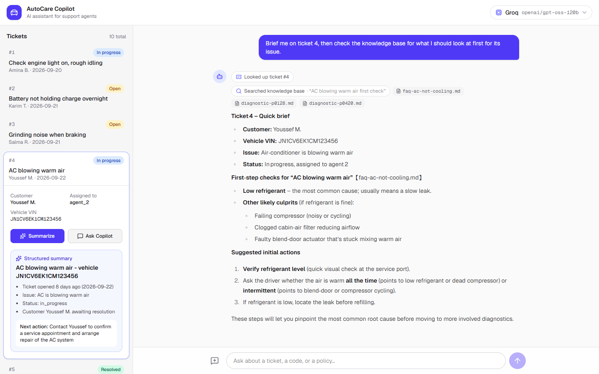
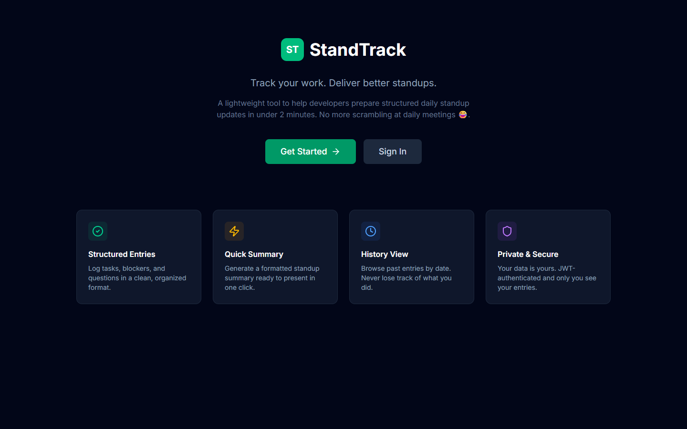
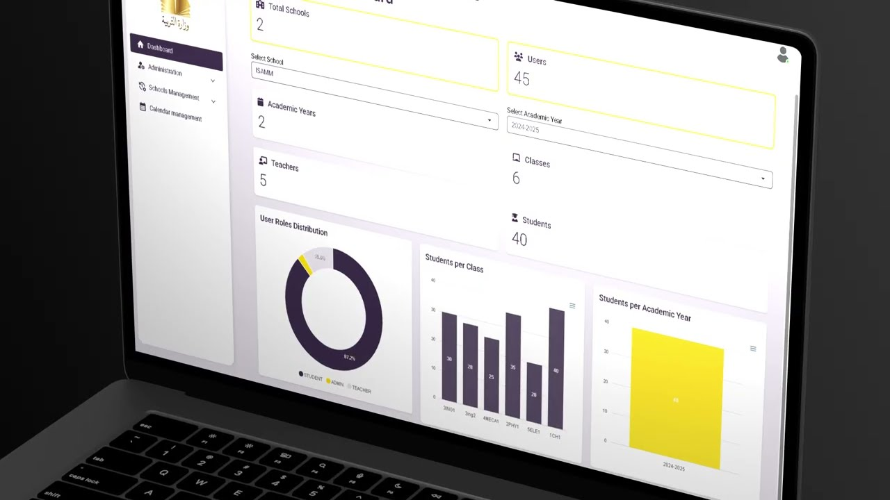
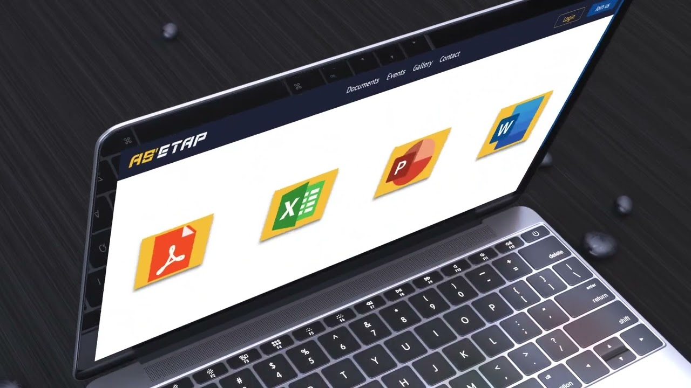

<h1 align="center">Mohamed Ounissi</h1>

  <b>Full-Stack Software Engineer</b> · Next.js · NestJS · AI-integrated apps

  

  
  
  
  

## What I do

<table>
  <tr>
    <td width="33%" valign="top">
      <b>Full-stack products</b> 
      Next.js and NestJS applications from UI to API, TypeScript end to end, with MongoDB or PostgreSQL behind them.
    </td>
    <td width="33%" valign="top">
      <b>AI features that hold up</b> 
      Streaming LLM chat, tool calling, structured output and RAG with vector search — measured with evals, not picked on reputation.
    </td>
    <td width="33%" valign="top">
      <b>Quality and delivery</b> 
      Jest, Vitest and Playwright tests, Swagger-documented APIs, Docker and CI/CD pipelines.
    </td>
  </tr>
</table>

I like turning unclear requirements into shipped features, and I treat tests and documentation as part of the work rather than an afterthought. I work in Agile / Scrum teams and care about clean, readable code.

**Education:** Software engineering degree — Higher Institute of Multimedia Arts of Manouba (ISAMM)  
**Languages:** Arabic (native) · English (fluent) · French (intermediate)  
**Open to:** Full-stack roles, freelance projects and collaboration on interesting products

## Featured project

### [AutoCare Copilot](https://github.com/mohamed-ounissi/AI-integrated-full-stack-development) — AI assistant for support agents

An assistant for auto-service support agents that answers from real data instead of guessing.

- **Tool calling** — asks about a ticket, and the model looks up the actual record in MongoDB.
- **RAG** — diagnostic-code and policy answers come from a knowledge base in MongoDB Atlas Vector Search, with the source doc cited.
- **Structured output** — one click turns a ticket into a schema-validated summary.
- **Multi-provider, measured** — Groq, Gemini and OpenRouter behind one interface, benchmarked on 10 fixed questions. Groq scored 10/10 at ~1.4 s per answer and became the default.

`Next.js` `NestJS` `MongoDB Atlas Vector Search` `Vercel AI SDK` `RAG` `TypeScript`

## More projects

<table>
  <tr>
    <td width="50%" valign="top">
      
      <h3><a href="https://github.com/mohamed-ounissi/StandTrack">StandTrack</a> · <a href="https://stand-track.vercel.app">live app</a></h3>
      Daily standup companion for developers: log tasks, blockers and questions during the day, then get an auto-formatted summary before the meeting. Dynamic meeting times and email reminders.
        
      <code>TypeScript</code> <code>Next.js</code> <code>Node.js</code>
    </td>
    <td width="50%" valign="top">
      
      <h3>School administration platform · <a href="https://www.youtube.com/watch?v=eJkak_rYYIM">demo</a></h3>
      Microservices-based school management system with automatic timetable generation using OptaPlanner, containerized with Docker and deployed through a GitLab CI/CD pipeline.
        
      <code>Angular</code> <code>Spring Boot</code> <code>PostgreSQL</code> <code>Docker</code> <code>GitLab CI</code>
    </td>
  </tr>
  <tr>
    <td width="50%" valign="top">
      
      <h3>ASETAP · <a href="https://www.youtube.com/watch?v=snkmWytzOWc">demo</a></h3>
      Management application for a sports association, covering members, events and administration — designed and built end to end.
        
      <code>React</code> <code>Express</code> <code>MongoDB</code>
    </td>
    <td width="50%" valign="top">
      <h3><a href="https://github.com/mohamed-ounissi/MorbiketFinalProduct">Morbiket WebAR</a></h3>
      Platform for creating augmented reality experiences that run directly in the browser, built during an internship at a visual design agency.
        
      <code>React</code> <code>A-Frame</code> <code>AR.js</code> <code>Three.js</code>
       
      <h3><a href="https://github.com/mohamed-ounissi/React-native-project">React Native app</a></h3>
      Mobile app with modular authentication, tab-based navigation and a scalable structure for API-driven dashboards and list/detail screens.
        
      <code>React Native</code> <code>Expo</code> <code>TypeScript</code>
    </td>
  </tr>
</table>

## Tech stack

| Category | Tools |
| --- | --- |
| **Languages** |      |
| **Frontend** |      |
| **Backend** |      |
| **AI** |      |
| **Databases** |    |
| **Testing** |    |
| **DevOps** |      |
| **Workflow** |    |

## GitHub stats

  
  
  

<b>Background</b>

 

**Experience**

- **Software Engineer** (Oct 2025 – Present) — full-stack web development with Next.js and NestJS, Tailwind CSS, automated testing (Jest, Vitest, Playwright) and Swagger-documented APIs, in an Agile / Scrum team.
- **ST2i** — end-of-studies project (Feb 2025 – Jun 2025) — microservices-based school administration app with Angular and Spring Boot, PostgreSQL, OptaPlanner timetable generation, Docker and GitLab CI/CD.
- **SE Bordnetze El Fejja** — web development and DevOps intern (Jul 2024 – Aug 2024) — internal team management platform with React, Express and Sequelize on SQL Server, containerized with Docker and analyzed with SonarQube.
- **Morbiket** — web and AR development intern (Jul 2023 – Aug 2023) — browser-based augmented reality builder using React, A-Frame, AR.js and Three.js, with Node.js, Express and MongoDB on the backend.
- **Tunisian Company of Petroleum Activities** — end-of-studies project (Feb 2022 – Jun 2022) — sports association management app **ASETAP** with React, Node.js, Express and MongoDB.

**Education**

- Software engineering degree — Higher Institute of Multimedia Arts of Manouba (2022–2025)
- Bachelor's degree in computer science and multimedia — ISAMM (2019–2022)

  <a href="mailto:mohamed.ounissi2021@gmail.com">mohamed.ounissi2021@gmail.com</a> ·
  <a href="https://www.linkedin.com/in/mohamed-ounissi/">LinkedIn</a> ·
  <a href="https://portfolio-app-gold-iota.vercel.app/mohamed-ounissi/">Portfolio</a>

